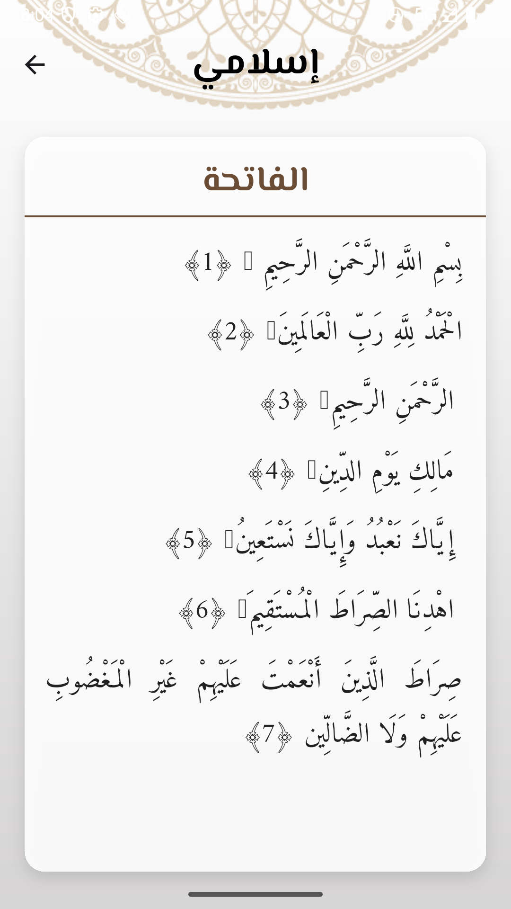
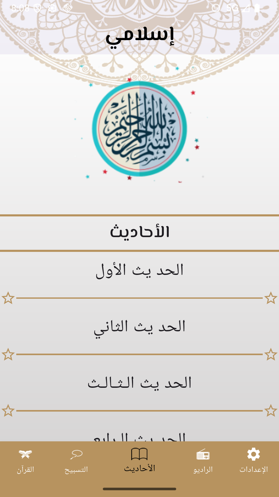
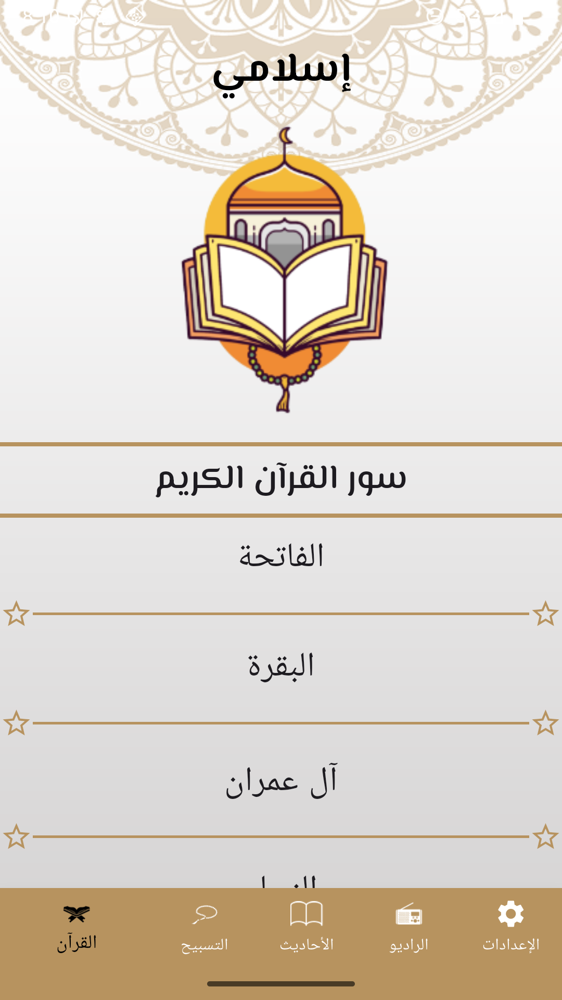
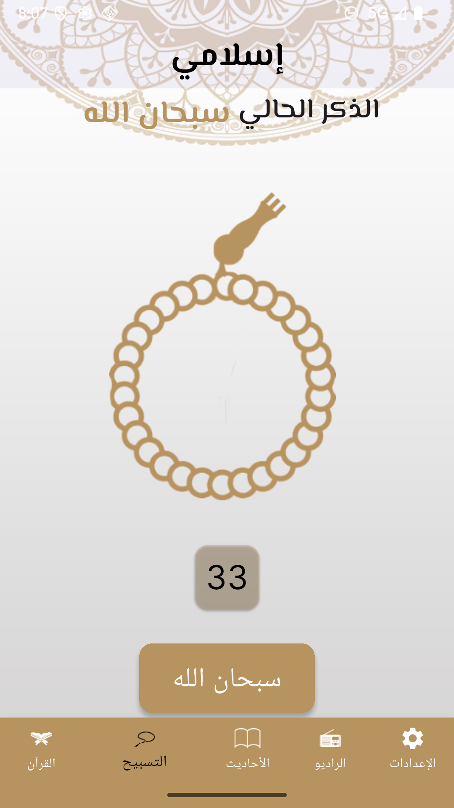

# 🚀 muslim


## 🧩 Features
- 🌙 Custom splash screen
- 🧭 Smooth navigation between screens using Bottom Navigation Bar
- 🏁 Using `initialRoute` for controlled app navigation
- 📿 Custom Sebha screen
- 📖 Custom Quran screen
- 📜 Custom Hadith screen
- 📂 Reads text files from assets
- read fiel 
## 📦 Packages Used
- [`flutter_native_splash`](https://pub.dev/packages/flutter_native_splash) – for custom splash screen
- [`google_fonts`](https://pub.dev/packages/google_fonts) – for elegant Arabic typography


## 📱 Screenshots

|                Quran                  |                 Quran                  |                      Hadith                      |
|:-------------------------------------:|:--------------------------------------:|:------------------------------------------------:|
|  |  |  |

|                Sebha                  | 
|:-------------------------------------:|
|  | 


## 🛠️ How to Run
```bash
flutter pub get
flutter run

